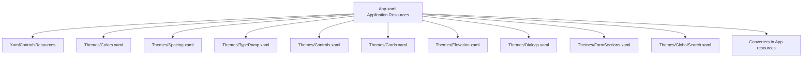

# UI · Design Tokens 与主题体系（阶段 1）

**代码真源**：[`src/PMTool.App/App.xaml`](../../src/PMTool.App/App.xaml) 合并顺序 + [`Themes/`](../../src/PMTool.App/Themes/) 下各字典。  
**策略**：自定义表面与品牌色在 **Light/Dark** 下使用**同名**画笔键；页面与主题 **Style** 中对画笔使用 `{ThemeResource ...}`，对 **Style** 本身继续 `{StaticResource ...}`（样式键不分主题，内部 Setter 已用 ThemeResource 指画笔）。

---

## 1. 资源字典拓扑（合并顺序）

| 文件 | 职责 |
|------|------|
| `Colors.xaml` | `ThemeDictionaries` **Light** / **Dark**：`Alone*Brush`、`AlonePrimaryGradientBrush`、`SearchRowHighlightBrush`、语义色、禁用文字色 |
| `Spacing.xaml` | `AloneSpace4`～`24`、兼容 `Spacing4/6/8`、`NavRailWidth`、`OperationBarHeight`、`DetailPanelWidth`、圆角 **Small / Default / Large** |
| `TypeRamp.xaml` | 字号常量、`TextBlock` **Style**（含标题/副标题/正文/次级正文/标签/caption）；画笔 Setter 均为 **ThemeResource** |
| `Controls.xaml` | `Button` 等控件 Style；渐变与表面引用 **ThemeResource** |
| `Cards.xaml` | 列表卡片间距、标题/元信息/状态 Chip 样式 |
| `Elevation.xaml` | 扁平策略下的浮层参数（`AloneShadow*` 数值文档化）、`ThemeShadow`、`AloneFloatChromeBorderStyle`（仅浮层根） |
| `Dialogs.xaml` | `ContentDialog` 圆角与对话框内按钮样式；`AloneDialogDestructivePrimaryButtonStyle`；`AloneFlyoutPresenterStyle`（亚克力 + `DefaultCornerRadius` + `AloneFlyoutPanelPadding`）；`AloneFormTextBoxStyle` / `AloneFormNumberBoxStyle` / `AloneFormToggleSwitchStyle`；`AloneDialogContentPadding` |
| `FormSections.xaml` | 长表单页区块：`AloneFormSectionCardStyle`（`BorderThickness="0"` + `AloneSurfaceContainerLowBrush` + `AloneFormSectionCardPadding`）；`AloneFormSectionTitleStyle` / `AloneFormSectionDescriptionStyle`；`AloneFormSectionSpacing`（节与节垂直间距）；`AloneFormPageScrollBottomPadding`（滚动内容底部呼吸）；`AloneFormPageStickyFooterStyle` / `AloneFormPageStickyFooterPadding`（可选固定底栏，与 Scroll 内容表面区分层） |
| `GlobalSearch.xaml` | 全局搜索面板结果行：`AloneGlobalSearchHitRowMinHeight`、`AloneGlobalSearchHitRowPadding`、`AloneGlobalSearchHitButtonStyle`（自定义模板，避免 Fluent `PointerOver` 覆盖 `Background` 绑定）、`AloneGlobalSearchFocusVisualMargin`；高亮色与列表跳转一致，统一使用 [`SearchRowHighlightBrush`](../../src/PMTool.App/Themes/Colors.xaml) + [`SearchRowBackgroundConverter`](../../src/PMTool.App/Converters/SearchRowBackgroundConverter.cs) |

**阶段 6（全局搜索浮层）约定**：Flyout 外壳 = [`AloneFlyoutPresenterStyle`](../../src/PMTool.App/Themes/Dialogs.xaml)（亚克力 + 圆角 + `AloneFlyoutPanelPadding`）；[`GlobalSearchPanel`](../../src/PMTool.App/Controls/GlobalSearchPanel.xaml) 根 **Background 透明**，材质不重复叠灰；结果行默认表面与转换器「非高亮」支路一致（`AloneSurfaceContainerLowestBrush`），键盘/选中索引行用 `SearchRowHighlightBrush`。不在此面板再套 `AloneFloatChromeBorderStyle` 整块实色壳（易与 Presenter 冲突）。

**阶段 5 长页布局约定**（`SettingsPage`、`DataManagementPage`）：根 `ScrollViewer` **横向** `Padding="0"`，左右由 Shell `AloneContentHostPadding` 负责；内层 `StackPanel`（或单一大纲容器）`MaxWidth="920"`（或与项目既有长页策略一致）、`HorizontalAlignment="Stretch"`、节间 `Spacing` 引用 `AloneFormSectionSpacing`，最外层内容设 `Padding="{StaticResource AloneFormPageScrollBottomPadding}"` 以免内容贴底；需常驻操作（如设置页快捷键保存/恢复默认）用 **两行 `Grid`**：`Row0` = `ScrollViewer`，`Row1` = 套用 `AloneFormPageStickyFooterStyle` 的 `Border` + 横向按钮区；节内嵌套列表行等继续用 `AloneSurfaceContainerHighestBrush` + `DefaultCornerRadius`，不用 `BorderThickness="1"` 做主分割。

**代码侧**： imperative 对话框统一走 [`AloneDialogFactory`](../../src/PMTool.App/UI/AloneDialogFactory.cs)（使用 `WinUiApplication.Current` 取资源，避免与 `PMTool.Application` 程序集名冲突）。

---

## 2. 色板速查

### 2.1 表面与品牌（同名键，Light/Dark 值不同）

| 键 | 用途 |
|----|------|
| `AloneSurfaceBrush` | 页面根背景 |
| `AloneSurfaceContainerLowBrush` | 侧栏、大区块 |
| `AloneSurfaceContainerLowestBrush` | 卡片/高亮台面 |
| `AloneSurfaceContainerHighBrush` / `AloneSurfaceContainerHighestBrush` | 更高一层容器 |
| `AlonePrimaryBrush` | 主色 **#0078D4**（两主题一致） |
| `AlonePrimaryContainerBrush` | 渐变深色端 / 深色主题下略提亮 |
| `AlonePrimaryGradientBrush` | 主按钮背景 |
| `AloneOnSurfaceBrush` / `AloneOnSurfaceVariantBrush` | 正文 / 辅助文字 |
| `AloneOnPrimaryBrush` | 主按钮上的文字 |
| `AloneSecondaryContainerBrush` / `AloneNavHoverBrush` | 次要容器、导航悬停（带透明度） |
| `AloneOnSurfaceDisabledBrush` | 禁用态文字（约 38% 不透明） |

### 2.2 语义色

| 键 | 用途 |
|----|------|
| `AloneSuccessBrush` | 成功 |
| `AloneWarningBrush` | 警告 |
| `AloneErrorBrush` | 错误 |
| `AloneInfoBrush` | 信息（常接近主色） |

### 2.3 其它

| 键 | 用途 |
|----|------|
| `SearchRowHighlightBrush` | 全局搜索列表高亮行（随主题变化） |

---

## 3. 间距与圆角

| 键 | 值 (dip) | 说明 |
|----|-----------|------|
| `AloneSpace4` | 4 | 细缝、紧凑内边距 |
| `AloneSpace8` | 8 | 小间距 |
| `AloneSpace12` | 12 | 中间距 |
| `AloneSpace16` | 16 | 与旧 **Spacing4** 相同 |
| `AloneSpace24` | 24 | 与旧 **Spacing6** 相同 |
| `Spacing4` | 16 | **兼容**：等同设计 spacing-4 |
| `Spacing6` | 24 | **兼容**：等同 design spacing-6 |
| `Spacing8` | 32 | **兼容**：更大呼吸区 |
| `CornerRadiusSmall` | 4 | 搜索条等 |
| `DefaultCornerRadius` | 8 | 默认（卡片、按钮） |
| `CornerRadiusLarge` | 12 | 大卡、弹层 |

**阶段 2（Shell）补充**：`AloneContentMaxWidth`（主内容最大宽度）、`AloneNavItemHeight` / `AloneNavItemPadding` / `AloneNavIconBox`、`AloneContentHostPadding`（`Frame` 宿主横向留白）、`AloneOperationBarPadding`、`AloneChromeButtonPadding`、`AloneNavRailOuterPadding` / `AloneNavHeaderStackPadding` / `AloneNavFooterSeparatorPadding`、`AloneFlyoutPanelPadding`、`AloneDetailPanelMargin` 等见 [Spacing.xaml](../../src/PMTool.App/Themes/Spacing.xaml)；顶栏筛选排序使用 **`AloneChromeButtonStyle`**（[Controls.xaml](../../src/PMTool.App/Themes/Controls.xaml)）。

新页面优先引用 **`AloneSpace*`**；旧页可逐步从魔法数迁移。

---

## 4. 字阶（TextBlock Style）

| 键 | 语义 |
|----|------|
| `AloneTitleTextBlockStyle` | 模块/页主标题（基于 HeadlineSm） |
| `AloneHeadlineSmTextBlockStyle` | 大标题 |
| `AloneTitleLgTextBlockStyle` / `AloneTitleSmTextBlockStyle` | 标题层级 |
| `AloneSubtitleTextBlockStyle` | 副标题（辅色） |
| `AloneBodyTextBlockStyle` / `AloneBodyMdTextBlockStyle` | 正文 |
| `AloneBodySecondaryTextBlockStyle` | 正文次级 |
| `AloneLabelMdTextBlockStyle` | 标签、元数据 |
| `AloneCaptionTextBlockStyle` | Caption（11px） |
| `AloneDisplayMdTextBlockStyle` | 空状态大标题 |

**CaptionFontSize** 等资源键在 `TypeRamp.xaml`；`Foreground` 一律 **ThemeResource** 指向 `Alone*` 画笔。

---

## 5. Elevation（扁平优先）

- **默认**：列表、壳体主区域**不加** `ThemeShadow`。
- **仅浮层**（全局搜索外壳、Flyout、菜单根）：可使用 `AloneFloatChromeBorderStyle` 或自行对根 `Border` 设置 `Shadow="{StaticResource AloneFloatThemeShadow}"`。
- **文档化参数**：`AloneShadowBlurFloat`（32）、`AloneShadowOffsetYFloat`（8）、`AloneShadowOpacityFloat`（0.06）— WinUI `ThemeShadow` 由系统渲染，数值供设计与后续模板对齐参考。

---

## 6. 不用 `BorderThickness` 做「分割」的约定

1. **区块分区**：靠 **背景阶梯**（`AloneSurface*` vs `AloneSurfaceContainer*Brush`）+ **间距**（`Margin`/`Padding` 用 `AloneSpace*` 或 `Spacing*`）。  
2. **卡片**：`CornerRadius` + `AloneSurfaceContainerLowestBrush`，卡片之间用 **垂直 `Spacing` gutter**，不用 `BorderThickness="1"` 分隔线。  
3. **Ghost 边界**（同底色需微量分离时）：`Border` + `BorderBrush="{ThemeResource ControlStrokeColorDefaultBrush}"`（或 `ControlStrongStrokeColorDefaultBrush`）+ **`BorderThickness="1"` 且 Opacity 极低**（例如整块 `Border` `Opacity="0.15"`），用于 whisper 边界；**禁止**高对比 1px 通栏分割线风格。  
4. **导航/按钮**：继承现有「无描边 + 透明底 + 表面高亮层」模式；`AloneNavItemButtonStyle` 仍 `BorderThickness="0"`（不是分割线语义）。

---

## 7. XAML 引用约定（ThemeResource vs StaticResource）

| 用法 | 标记扩展 | 说明 |
|------|----------|------|
| `Alone*Brush`、`SearchRowHighlightBrush`、`AlonePrimaryGradientBrush` | **ThemeResource** | 随 `Application.RequestedTheme` 解析 [Colors.xaml](../../src/PMTool.App/Themes/Colors.xaml) 的 Light/Dark 词典 |
| `TextFillColor*`、`SystemFillColor*`、`Acrylic*`、`Control*` 等 WinUI 系统画笔（作 `Foreground` / `Background` / `BorderBrush`） | **ThemeResource** | 随当前应用主题解析；**禁止**对上述「随主题变化的画刷」使用 `StaticResource`，否则易出现换幕后前景仍锁在旧主题解析结果的问题 |
| 页面内 **错误/警告** 长文案条幅 | **ThemeResource** `AloneErrorBrush` / `AloneWarningBrush`（推荐）或与上项一致的系统语义色 + **ThemeResource** | 与调色板成对维护，深浅可读性一致（阶段 7 实装采用 `Alone*`） |
| `Alone*TextBlockStyle`、`Alone*ButtonStyle` | **StaticResource** | 样式键名不随主题变；Style 内 Setter 对画刷仍须 **ThemeResource** |
| `ThemeShadow`、间距/圆角 `x:Double` / `Thickness` / `CornerRadius`（无 Light/Dark 分支的字典键） | **StaticResource** | 纯数值或与主题无关的资源 |

**维护检索（Code Review 可粘贴）**：在仓库内对 `src/PMTool.App` 的 XAML 自检可疑用法，例如：

- `StaticResource` 与 `Brush` 同文件同层：`Foreground="\{StaticResource`、`\{StaticResource .*Brush`
- 系统键名：`SystemFillColor`、`TextFillColor` 等若与 `StaticResource` 同现，优先改为 **ThemeResource** 或改用 `Alone*` 语义色

排除 `obj/`、`bin/` 目录。

**跟随系统**：应用在配置为 `FollowSystem` 时会订阅 `UISettings.ColorValuesChanged` 并在防抖后重算 `Application.RequestedTheme`，见 [`App.ApplyRequestedTheme`](../../src/PMTool.App/App.xaml.cs)。

---

## 8. 阶段 8 附录：列表性能、编译绑定与阴影负载

本附录与 [acceptance-matrix 阶段 8](./acceptance-matrix.md) 走查一致，供代码评审与后续迭代引用。

**编译绑定（WinUI）**：列表、卡片等 `DataTemplate` 必须声明 `x:DataType` 并在模板内使用 **`x:Bind`**（`Mode` 显式），避免页面级反射 `Binding` 回退。极少数需 `ElementName` 指向页面根以转发 `RelayCommand` 的模板行可保留 `Binding`，应在 PR 中注明原因。

**虚拟化**：`ScrollViewer` 内嵌 **`ItemsControl` 不提供 UI 虚拟化**，大列表依赖 PRD 业务上限；若日后要承载更长列表，需在不影响行内按钮、选中与看板并存的前提下评估迁移至 **`ListView`**（或其容器）或 **`ItemsRepeater`**（配合布局与交互重做），单独立项与回归。

**视觉负载（Elevation）**：与 **§5 Elevation（扁平优先）** 一致 — **列表行、列表外框、表格主区域**不叠加 `ThemeShadow`；仅 **浮层根**（对话框、Flyout、`AloneFloatChromeBorderStyle` 等）使用既有阴影策略，避免滚动区内阴影堆积。

---

## 9. 相关文档

- [UI_REFACTOR_PHASE0_BASELINE.md](./UI_REFACTOR_PHASE0_BASELINE.md)：原型映射、阶段 0 非目标与优先级（§5 Token 表为快照，**以色板实现与本文为准**）。
- [acceptance-matrix.md](./acceptance-matrix.md)：按页勾选验收。
